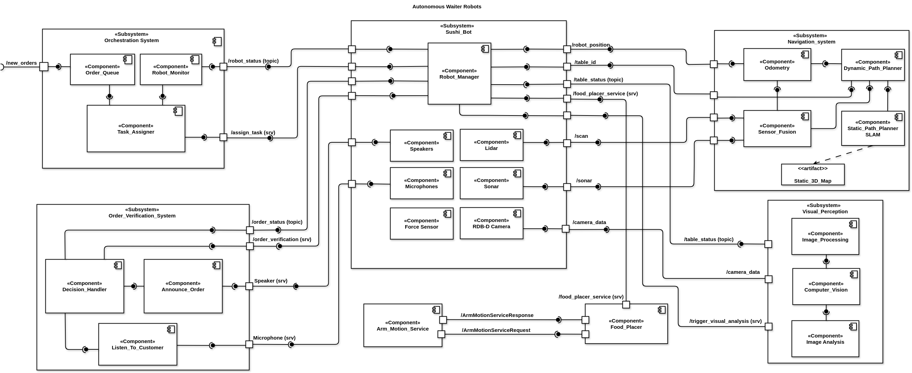

System Architecture
=====================

.. contents::
   :local:
   :depth: 1

1. Component Diagram
--------------------

   **Figure 1:** System Overview (Component Diagram) of Autonomous Waiters System

.. note::
    Main Subsystems in this architecture is described in greater detail in the relevant sections of this documentation.

2. Main Components
------------------

1. **Orchestration System**  
    The centralized coordination node of the restaurant environment. It:
        - Manages incoming orders
        - Assigns tasks to available robots via namespaced services
        - Tracks and monitors global task execution status

2. **Order Verification System**  
    Responsible for verifying that the dish being delivered matches the customer's order. It uses:
        - Robot-mounted microphones to capture verbal confirmation
        - Robot speakers to announce dishes
        - Logic to determine confirmation or rejection, publishing results to the corresponding robot namespace

3. **Food Placement Reasoning System**  
    Handles dish placement logic post-verification:
        - Selects a suitable placement strategy based on visual table status (e.g., empty, occupied, cluttered)
        - Validates candidate poses for reachability using motion feasibility services
        - Triggers low-level arm movement to place the food
        - Handles optional removal of an empty plate before new placement

4. **Robot Manager**  
    A robot-specific control node that manages all onboard operations, including:
        - Receiving and executing assigned delivery tasks
        - Navigating to destinations
        - Initiating order verification and visual analysis
        - Calling the `food_placer_service` for final dish placement
        - Reporting task status, results, or failures to the Orchestration System

3. Supporting Components
------------------------

1. Visual Perception System
^^^^^^^^^^^^^^^^^^^^^^^^^^^

**Responsibilities**
    - Analyzes real-time RGB and depth images to detect the current state of the table (e.g., `EMPTY`, `PARTIALLY_OCCUPIED`, or `CLUTTERED`) and identifies the presence of empty plates.
    - Publishes the table status for use by the robot manager and food placement system.
    - Exposes an on-demand service to trigger a table status update.

**Subscriber**

.. csv-table:: Image Input Interfaces
   :header: "Topic", "Type", "Message", "Stateless/Stateful", "Strongly Typed", "Description"
   :widths: 20, 15, 20, 15, 10, 30

   "/xtion/rgb/image_raw", "ROS Topic", "sensor_msgs/Image", "Stateless", "Yes", "Receives RGB images for surface analysis"
   "/xtion/depth/image_raw", "ROS Topic", "sensor_msgs/Image", "Stateless", "Yes", "Receives depth data for 3D spatial analysis"

**Service**

.. csv-table:: Analysis Service
   :header: "Service", "Type", "Message", "Stateless/Stateful", "Strongly Typed", "Description"
   :widths: 20, 15, 20, 15, 10, 30

   "/trigger_visual_analysis", "ROS Service", "TriggerAnalysis.srv", "Stateless", "Yes", "On-demand table analysis trigger"

**Publisher**

.. csv-table:: Results Output
   :header: "Topic", "Type", "Message", "Stateless/Stateful", "Strongly Typed", "Description"
   :widths: 20, 15, 20, 15, 10, 30

   "/table_status/{robot_id}", "ROS Topic", "TableStatus.msg", "Stateful", "Yes", "Publishes analyzed table state (latched)"

**System Integration**

.. csv-table:: External Communication
   :header: "System", "Direction", "Interface", "Type", "Data Format", "Stateless/Stateful", "Strongly Typed"
   :widths: 15, 10, 20, 15, 20, 10, 10

   "Robot Manager", "Input", "/trigger_visual_analysis", "ROS Service", "robot_id", "Stateless", "Yes"
   "Robot Manager", "Output", "/table_status/{robot_id}", "ROS Topic", "status, has_empty_plate", "Stateful", "Yes"

2. Navigation System
^^^^^^^^^^^^^^^^^^^^
Provides autonomous path planning and obstacle avoidance:
    - Uses SLAM to localize robots
    - Enables safe travel between various location in Restaurant

3. Arm Motion Service
^^^^^^^^^^^^^^^^^^^^^

**Responsibilities**
    - Validates robot arm's joint states (positions, velocities, efforts).
    - Verifies if a given pose is reachable.
    - Returns success or failure based on the reachability of the pose.

**Service (Server)**

.. csv-table:: Arm Motion Service
   :header: "Service", "Type", "Message", "Stateless/Stateful", "Strongly Typed", "Description"
   :widths: 20, 15, 20, 15, 10, 30

   "/check_joint_state", "ROS Service", "CheckJointState.srv", "Stateless", "Yes", "Validates joint configurations and pose reachability"

**System Integration**

.. csv-table:: External Communication
   :header: "System", "Direction", "Interface", "Type", "Data Format", "Stateless/Stateful", "Strongly Typed"
   :widths: 20, 10, 20, 15, 20, 10, 10

   "Food Placement System", "Input", "/check_joint_state", "ROS Service", "positions[7], velocities[7], efforts[7]", "Stateless", "Yes"

4. Speaker Service
^^^^^^^^^^^^^^^^^^

**Responsibilities**
    - Receives text messages from other components and simulates speaking them.
    - Returns a success status based on the message processing outcome.

**Service (Server)**

.. csv-table:: Speaker Service Interface
   :header: "Service", "Type", "Message", "Stateless/Stateful", "Strongly Typed", "Description"
   :widths: 20, 15, 20, 15, 10, 30

   "/speaker", "ROS Service", "Speaker.srv", "Stateless", "Yes", "Text-to-speech conversion service"

**System Integration**

.. csv-table:: External Communication
   :header: "System", "Direction", "Interface", "Type", "Data Format", "Stateless/Stateful", "Strongly Typed"
   :widths: 20, 10, 20, 15, 20, 10, 10

   "Order Verification", "Input", "/speaker", "ROS Service", "text_message", "Stateless", "Yes"

5. Microphone Service
^^^^^^^^^^^^^^^^^^^^^

**Responsibilities**
    - Simulates listening for a response (e.g., "yes", "no", or no response).
    - Handles audio input simulation and returns a predefined response or failure.

**Service (Server)**

.. csv-table:: Microphone Service Interface
   :header: "Service", "Type", "Message", "Stateless/Stateful", "Strongly Typed", "Description"
   :widths: 20, 15, 20, 15, 10, 30

   "/microphone", "ROS Service", "Microphone.srv", "Stateless", "Yes", "Simulated voice input service"

**System Integration**

.. csv-table:: External Communication
   :header: "System", "Direction", "Interface", "Type", "Data Format", "Stateless/Stateful", "Strongly Typed"
   :widths: 20, 10, 20, 15, 20, 10, 10

   "Order Verification", "Input", "/microphone", "ROS Service", "Empty request", "Stateless", "Yes"

4. System Workflow
-------------------

The system follows a coordinated workflow where components interact through ROS services and topics to accomplish the restaurant serving tasks. Here's the operational flow:

1. **Order Assignment Phase**:

   - The **Orchestration System** receives new orders from the restaurant's ordering system.
   - It evaluates robot availability and assigns tasks to the most suitable robot via the **Robot Manager**.
   - The assignment includes order details and destination table information.

2. **Navigation Phase**:

   - The assigned **Robot Manager** initiates navigation to the serving area
   - The Navigation System plans a path using the static map and adjusts dynamically based on real-time sensor data
   - Once at the serving area, the robot retrieves the correct dish using computer vision

3. **Table Approach Phase**:

   - The robot navigates to the assigned table using the **Navigation System**
   - Upon arrival, the **Robot Manager** triggers the **Order Verification System**

4. **Order Verification Phase**:

   - The **Order Verification System**:

      - Uses the **Speaker Service** to announce the dish
      - Uses the **Microphone Service** to listen for customer confirmation
      - Determines if the order is correct or requires staff intervention

   - Verification results are reported back to the **Orchestration System**

5. **Food Placement Phase**:

   - If verification succeeds, the **Food Placement Reasoning System**:

      - Requests table status from the **Visual Perception System**
      - Determines optimal placement strategy (direct placement or plate removal first)
      - Validates reachability using the **Arm Motion Service**
      - Executes the placement via the robot's arm controller

   - If the table is occupied by another robot, the system coordinates waiting behavior.

6. **Task Completion Phase**:

   - The **Robot Manager** reports task completion to the **Orchestration System**
   - The robot either:

      - Returns to the serving station if no new tasks are assigned
      - Proceeds to clear empty plates if detected
      - Receives a new task from the **Orchestration System**