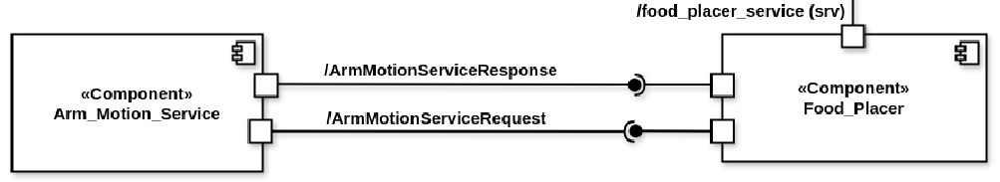

Food Placement Reasoning System
===============================

.. contents::
   :local:
   :depth: 1

.. index::
   Food Placement Reasoning System

1. System Overview
-------------------
The `FoodPlacer` service is responsible for performing the final act of food delivery — placing the dish on the table — while taking into account the real-time condition of the table surface. It utilizes strategy patterns to handle different table states and interfaces with a low-level arm controller to execute food placement.

This service is called by the `RobotManager` once order verification and visual analysis have been completed.

   **Figure 9:** Food Placement Reasoning System Architecture

**Responsibilities**

- Interpret visual table status to choose placement strategy.
- Generate and evaluate multiple candidate poses for food placement.
- Check reachability using a motion feasibility service.
- Trigger dish placement action if pose is valid.
- Handle optional removal of empty plate.
- Return final result to `RobotManager`.

2. ROS Interfaces
------------------

**Service (Server)**

.. csv-table:: FoodPlacer Service Interface
    :header: "Service", "Type", "Description", "Stateless/Stateful", "Strongly Typed"
    :widths: 25, 20, 35, 10, 10

    "/robotX/food_placer_service", "ROS Service", "Called by RobotManager to initiate food placement", "Stateless", "Yes"

**Service (Client)**

.. csv-table:: External Services Called
    :header: "Called Service", "Type", "Purpose", "Stateless/Stateful", "Strongly Typed"
    :widths: 25, 20, 35, 10, 10

    "/check_joint_state", "ROS Service", "Verifies reachability of candidate poses", "Stateless", "Yes"

3. Behavioral Flow
-------------------
1. **Trigger**  

    The `RobotManager` calls `/robotX/food_placer_service`, passing the current table status and whether the table has an empty plate.

2. **Select Placement Strategy**
    Based on table status (`EMPTY`, `PARTIALLY_OCCUPIED`, or `CLUTTERED`), a corresponding strategy is selected
        - `EmptyTableStrategy`: Place in default center position.
        - `OccupiedTableStrategy`: Try multiple scattered positions.
        - `ClutteredTableStrategy`: Try smaller reachable zones.

3. **Pose Generation & Validation**  
    - Candidate poses are generated using the chosen strategy.
    - Each pose is checked using `/check_joint_state` to determine if it's reachable.

4. **Placement Attempt**  
    - If a pose is reachable, the robot simulates food placement at that location.
    - If the table has an empty plate, a short delay simulates its removal.

5. **Success / Failure**  
    - Returns `True` if placement succeeds within 3 tries.
    - Otherwise, returns `False` and optionally triggers fallback logic.

4. System Integration
----------------------
The Food Placement Reasoning module relies on integration with multiple external systems to determine a valid pose and perform the food placement. These integration points ensure smooth coordination with perception, motion control, and robot management components.

.. csv-table:: External System Communication
    :header: "System", "Direction", "Interface", "Type", "Data Format", "Stateless/Stateful", "Strongly Typed"
    :widths: 15, 10, 20, 15, 25, 10, 10

    "Robot Manager", "Input", "/robotX/food_placer_service", "ROS Service", "table_status, has_empty_plate", "Stateless", "Yes"
    "Arm Motion Service", "Output", "/check_joint_state", "ROS Service", "joint positions/velocities", "Stateless", "Yes"
    "Robot Motion Controller", "Output", "Internal API", "Method Call", "pose (x, y, z)", "Stateful", "Yes"

Design Pattern
^^^^^^^^^^^^^^
**Strategy Pattern**  
    Table state is abstracted using different placement strategies:
        - `EmptyTableStrategy`
        - `OccupiedTableStrategy`
        - `ClutteredTableStrategy`

.. note::
   Can be extended to include other placement strategies.
