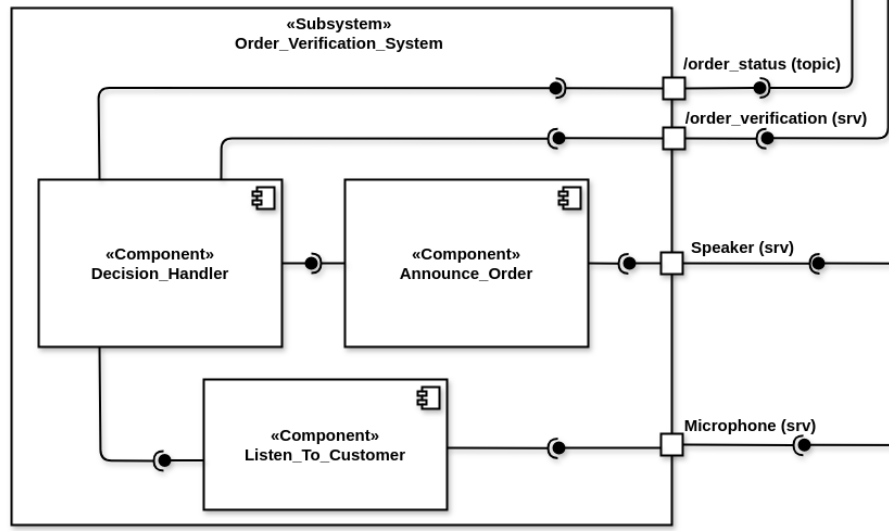
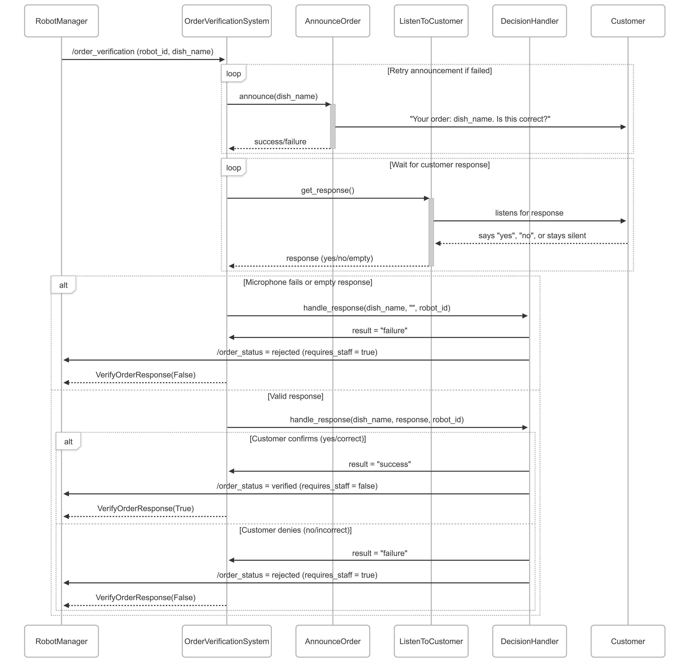
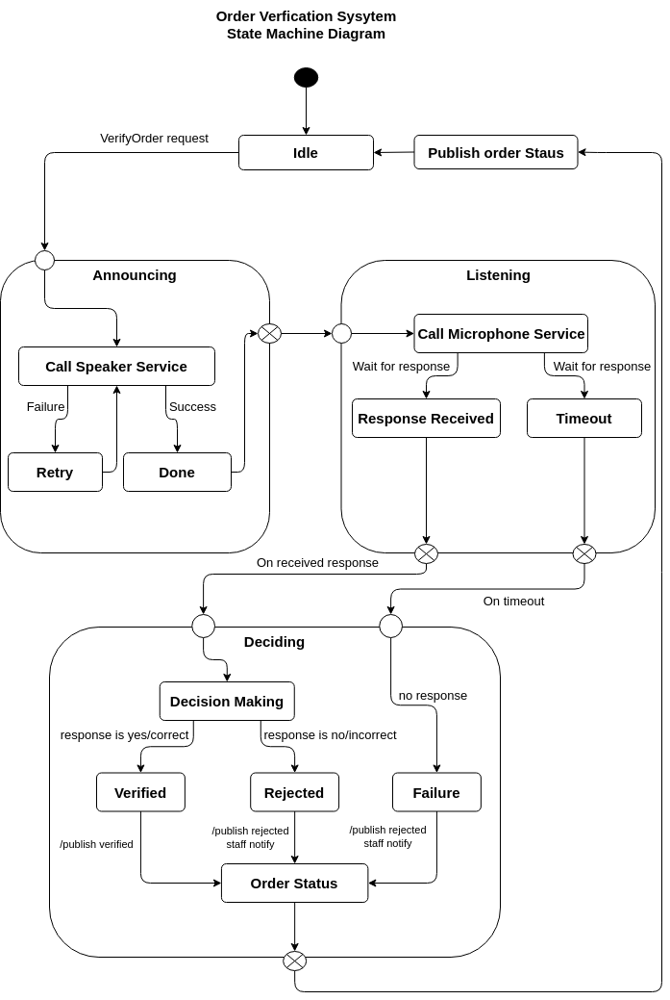

Order Verification System
=========================

.. contents::
   :local:
   :depth: 1

1. System Overview
-------------------
The Order Verification System ensures accurate order fulfillment through voice-based customer confirmation. Its responsibilities include:

- **Dish Announcement**: Communicates order details to the customer via speech.
- **Response Processing**: Captures and analyzes verbal confirmation or rejection.
- **Decision Making**: Determines verification results based on user input.
- **Status Reporting**: Updates the system on the current verification state, including escalation flags.

   **Figure 5 :** Order Verification System Architecture

2. Core Components
-------------------

1. **Announce Order**
    - Converts order details into natural language announcements.
    - Interfaces with the speaker system.
    - Includes retry mechanism on speech failure.

2. **Listen To Customer**
    - Uses the microphone service to capture audio input.
    - Waits for a valid response or times out gracefully.

3. **Decision Handler**
    - Interprets customer response.
    - Determines outcome: *Verified* or *Rejected*.
    - Flags rejections or timeouts for staff attention.

1. Announce Order
^^^^^^^^^^^^^^^^^^
**Function**:
    - Announces the dish name using the speaker system.
    - Retries up to 3 times if the speaker service fails.
    - Formats messages for clarity.

**Interfaces**:
    .. csv-table:: AnnounceOrder Communication
        :header: "Direction", "Endpoint", "Type", "Format", "Purpose", "Stateless/Stateful", "Strongly Typed"
        :widths: 10, 20, 15, 20, 25, 10, 10

        "Output", "/speaker_service", "ROS Service", "Speaker.srv", "Sends verbal announcements", "Stateless", "Yes"  
        "Input", "Internal API", "Method Call", "DishInfo", "Receives order details", "Stateless", "Yes"  

2. Listen To Customer
^^^^^^^^^^^^^^^^^^^^^^
**Function**:
    - Captures verbal response using the `/microphone` service.
    - Waits up to 5 seconds for a valid input.
    - Handles microphone service unavailability gracefully.

**Interfaces**:
    .. csv-table:: ListenToCustomer Communication
        :header: "Direction", "Endpoint", "Type", "Format", "Purpose", "Stateless/Stateful", "Strongly Typed"
        :widths: 10, 20, 15, 20, 25, 10, 10

        "Input", "/microphone", "ROS Service", "AudioStream", "Receives customer audio", "Stateless", "Yes"  
        "Output", "Internal API", "Method Call", "string", "Provides cleaned response", "Stateless", "Yes"  

3. Decision Handler
^^^^^^^^^^^^^^^^^^^^
**Function**:
    - Parses customer input to determine whether the order is confirmed or rejected.
    - Recognizes keywords like “yes”, “correct”, or “right” as confirmation.
    - Flags rejection or no response for staff attention.
    - Publishes verification status on a shared topic.

**Interfaces**:
    .. csv-table:: DecisionHandler Communication
        :header: "Direction", "Endpoint", "Type", "Format", "Purpose", "Stateless/Stateful", "Strongly Typed"
        :widths: 10, 20, 15, 20, 25, 10, 10

        "Output", "/order_status", "ROS Topic", "OrderStatus.msg", "Publishes verification outcome", "Stateful", "Yes"  

3. System Integration
----------------------
The Order Verification System integrates with several external systems, which is essential for its proper functioning. The communication points with these external systems are detailed below.

.. csv-table:: External System Communication
    :header: "System", "Direction", "Interface", "Type", "Data Format", "Stateless/Stateful", "Strongly Typed"
    :widths: 15, 10, 15, 15, 20, 10, 10

    "Task Assigner", "Input", "/verify_order", "ROS Service", "robot_id, dish_name", "Stateless", "Yes"
    "Speaker System", "Output", "/speaker", "ROS Service", "text_to_speak", "Stateless", "Yes"
    "Microphone", "Input", "/microphone", "ROS Service", "raw_audio", "Stateless", "Yes"
    "Order Status", "Output", "/order_status", "ROS Topic", "OrderStatus.msg", "Stateful", "Yes"

Design Patterns
^^^^^^^^^^^^^^^

The Order Verification System incorporates several design patterns to ensure clarity, modularity, and robustness:

- **State Pattern**  
    The verification process transitions through well-defined states such as *verifying*, *verified*, and *rejected*. This pattern is used implicitly within the ``DecisionHandler`` to manage the verification lifecycle and ensure consistent status updates across retries and failures.

- **Observer Pattern**  
    Once a decision is made, the system publishes the result to the ``/order_status`` topic. Other systems — like robot_manager — can subscribe and respond to these updates. This decouples verification from downstream processes, allowing clean event-driven communication.

- **Facade Pattern**  
    The interfaces to the microphone and speaker systems are encapsulated behind simple service call wrappers (``ListenToCustomer`` and ``AnnounceOrder``). This hides the low-level details and allows the rest of the system to interact with audio hardware through a unified, simplified interface.

4. Behavioral Diagram
-----------------------

1. Sequence Diagram
^^^^^^^^^^^^^^^^^^^^

   **Figure 6 :** Order Verification System Sequence Diagram

The sequence diagram above illustrates the interaction flow of the Order Verification System:

1. The **RobotManager** initiates the process by sending a verification request with the `robot_id` and `dish_name`.

2. The **OrderVerificationSystem** attempts to announce the order to the customer using the **AnnounceOrder** component. If the announcement fails (e.g., due to speaker issues), the system retries until successful.

3. Once the announcement is made, the system invokes **ListenToCustomer**, which listens for the customer's verbal confirmation or rejection through a microphone.

4. The customer's response (e.g., "yes", "no", or silence) is interpreted and returned to the main system.

5. The **DecisionHandler** processes the response:
    - If the response is empty or indicates rejection, it sets the order status to *rejected* and flags for staff attention.
    - If the response is positive (e.g., "yes", "correct"), it marks the order as *verified* without staff involvement.

6. Finally, a response is sent back to the **RobotManager** with the outcome, and the status is published on the `/order_status` topic for downstream systems to act upon.

This flow ensures a robust verification loop that can handle failures gracefully and escalate to human staff when needed.

2. StateMachine Diagram
^^^^^^^^^^^^^^^^^^^^^^^^

   **Figure 7 :** Order Verification System StateMachine Diagram

The state machine diagram illustrates the internal behavior of the Order Verification System from request to result publication.

- **Idle**: The default state of the system, waiting for a new verification request.

- **Announcing**: Triggered by a `VerifyOrder` request. The system attempts to verbally communicate the dish name to the customer.

  - On failure (e.g., speaker issue), the announcement is retried (up to a configured number of attempts).
  - On success, it transitions to the next phase.

- **Listening**: The system activates the microphone and waits for a response from the customer.

  - A valid response transitions to *DecisionMaking*.
  - Silence or microphone failure triggers the *Failure* path.

- **Deciding**: This phase evaluates the customer’s response.

    - **DecisionMaking**:
        - If keywords like “yes” or “correct” are detected, the system moves to *Verified*.
        - If “no” or an incorrect phrase is detected, it transitions to *Rejected*. In this case, the staff notification flag is set to `true` so the robot can request assistance.

    - **Failure**:
        - If no response is received within the timeout window, the result is treated as *Rejected*, and staff are notified automatically.

- **Publish Order Status**: The system publishes the outcome (`verified` or `rejected`) to `/order_status`, and returns the `VerifyOrderResponse` to the requesting component (usually the robot manager).

    - The system then transitions back to *Idle*, ready to handle the next verification.
